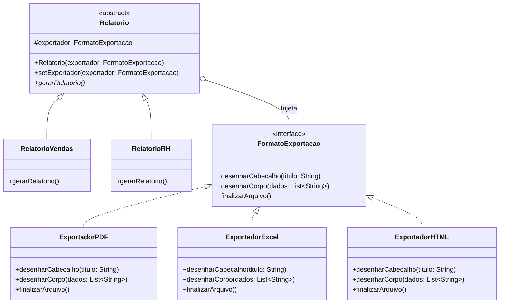

# Sistema de Relatórios TechFatec - Padrão Bridge

**Autor:** Diogo Marques Moreira  
**Curso:** Análise e Desenvolvimento de Sistemas - FATEC Zona Leste  
**Data:** Setembro de 2026  

## 📌 Escopo do Projeto (Fase 2)
A equipe de engenharia da TechFatec precisou expandir o módulo de relatórios legado, que gerava exclusivamente o "Relatório de Vendas" no formato PDF. O novo requisito exigiu a inclusão de um "Relatório de Desempenho de RH" e estipulou que todos os relatórios atuais e futuros devem ser exportáveis para **PDF, Excel (XLSX) e HTML**.

Para evitar a explosão de subclasses (ex: `RelatorioVendasPDF`, `RelatorioVendasExcel`, etc.) e aderir aos princípios SOLID, foi implementado o **Padrão de Projeto Bridge**.

## 🏗️ Arquitetura de Diretórios
O ecossistema do projeto impõe a separação física estrita dos componentes:

* `/src/abstracao/`: Contém as regras de negócio de alto nível (tipos de relatório).
* `/src/implementacao/`: Contém as lógicas de formatação (os exportadores de arquivo).
* `/src/cliente/`: O script principal (`Main.java`) responsável por instanciar os objetos e orquestrar as execuções, simulando o desacoplamento.

##  UML: Diagrama de Classes
Abaixo, o diagrama estrutural comprovando a separação entre Abstração e Implementação. A interface `FormatoExportacao` dita o contrato de desenho dos arquivos.



## UML: Diagrama de Sequência
O diagrama de sequência ilustra o fluxo de invocação durante a execução em tempo real (runtime), focando na composição do objeto via injeção.

```
sequenceDiagram
    participant Cliente as Cliente: Main
    participant Relatorio as relatorio: RelatorioVendas
    participant Exportador as exportador: ExportadorPDF

    Cliente->>Exportador: <<create>> new ExportadorPDF()
    Cliente->>Relatorio: <<create>> new RelatorioVendas(exportador)
    
    Cliente->>Relatorio: gerarRelatorio()
    
    Note right of Relatorio: Runtime objeto composition.<br>Invoca métodos do exportador.
    
    Relatorio->>Exportador: desenharCabecalho("Relatorio de Vendas")
    Exportador-->>Relatorio: return
    
    Relatorio->>Exportador: desenharCorpo(dadosVendas)
    Exportador-->>Relatorio: return
    
    Relatorio->>Exportador: finalizarArquivo()
    Exportador-->>Relatorio: return
    Relatorio-->>Cliente: return
 ```

##🛡️ Diretrizes Técnicas e Princípios Aplicados

1. Injeção de Dependência
É estritamente vedado o uso de instanciação direta (operador new) do exportador concreto dentro das classes filhas de Relatorio. A injeção da dependência ocorre exclusivamente via Construtor, garantindo o Princípio da Inversão de Dependência (DIP). Um método setExportador foi incluído para permitir a troca do formato em tempo de execução.

2. Princípio Aberto/Fechado (Open/Closed Principle)
O padrão Bridge nos permitiu adicionar um novo formato de saída (ExportadorHTML) e um novo tipo de métrica (RelatorioRH) sem realizar nenhuma modificação no código das classes já existentes (RelatorioVendas ou ExportadorPDF). O sistema está fechado para modificações, mas totalmente aberto para expansão.

## 🚀 Como Executar o Script de Validação
O projeto possui um script de validação de cliente em /src/cliente/Main.java.
Ao compilar e rodar a classe Main, o console exibirá:

A geração inicial de um Relatório de Vendas em PDF.

A alteração dinâmica e reaproveitamento do mesmo relatório para o formato Excel (XLSX) sem criar uma nova instância de RelatorioVendas.

A criação do novo Relatório de RH em HTML.
